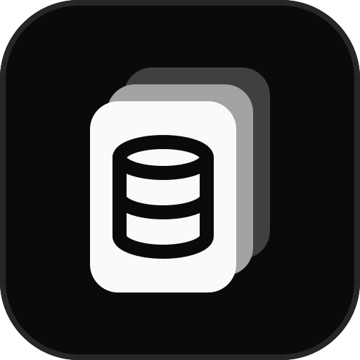
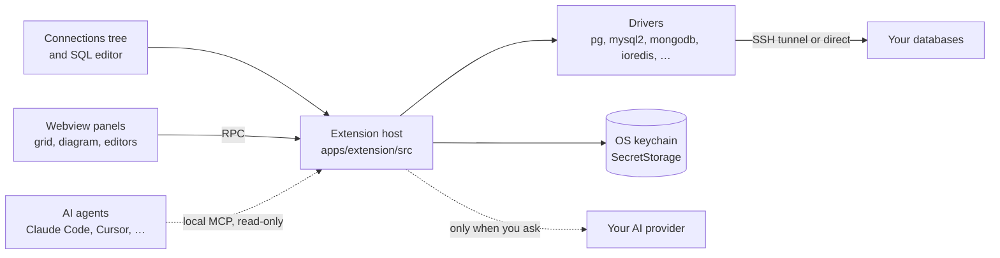

<p align="center">
  <a href="https://dbdeck.dev">
    
  </a>
</p>

<h1 align="center">DBDeck</h1>

<p align="center">
  <b>Your databases. Inside your editor.</b>
  <br>
  A free, open source database client for VS Code and Cursor.
  <br>
  No account, no paywall, no telemetry.
</p>

<p align="center">
  <a href="https://marketplace.visualstudio.com/items?itemName=dbdeck.dbdeck"></a>
  <a href="https://open-vsx.org/extension/dbdeck/dbdeck"></a>
  <a href="./LICENSE"></a>
  <a href="https://github.com/jurasw/dbdeck/actions/workflows/extension-check-on-pr.yml"></a>
  <a href="https://github.com/jurasw/dbdeck/stargazers"></a>
  <a href="./CONTRIBUTING.md"></a>
</p>

<p align="center">
  <a href="https://marketplace.visualstudio.com/items?itemName=dbdeck.dbdeck"><b>Install</b></a> ·
  <a href="https://dbdeck.dev">dbdeck.dev</a> ·
  <a href="https://open-vsx.org/extension/dbdeck/dbdeck">Open VSX</a> ·
  <a href="https://github.com/jurasw/dbdeck/releases/latest">Download VSIX</a> ·
  <a href="apps/extension/CHANGELOG.md">Changelog</a> ·
  <a href="https://github.com/jurasw/dbdeck/issues/new/choose">Report a bug</a>
</p>

<p align="center">
  <a href="https://dbdeck.dev">
    
  </a>
  <br>
  <sub>The extension's own data grid, fed with a demo shop database. Screenshots below come from VS Code.</sub>
</p>

## What it does

DBDeck puts your databases next to your code.
Add a connection, open a table and you are browsing rows, running SQL and fixing data without switching to another app.
Every connection lives in one sidebar tree, with SSH tunnels, SSL and read-only mode on each of them.
Nothing leaves your machine except the queries you send to your own databases.

<p align="center">
  <picture>
    <source media="(prefers-color-scheme: dark)" srcset="assets/readme/services-dark.svg">
    
  </picture>
</p>

<table>
  <tr>
    <td valign="top" width="50%">
      
      <h3>SQL editor</h3>
      <p>Put the cursor in a statement and press <kbd>⌘</kbd> <kbd>Enter</kbd>.
      Each statement gets its own result tab, with table and column completion that understands aliases.</p>
    </td>
    <td valign="top" width="50%">
      
      <h3>Schema diagrams</h3>
      <p>Any PostgreSQL or MySQL schema as a diagram, foreign keys linked column to column.
      Drag, pan, zoom and search; hover a table to light up its relations.</p>
    </td>
  </tr>
</table>

<table>
  <tr>
    <td valign="top" width="50%">
      
      <h3>Documents, edited in place</h3>
      <p>MongoDB and Elasticsearch documents in a grid or a JSON tree.
      Double-click a field to change it, or write shell-style queries like <code>db.users.find({...}).sort(...)</code>.</p>
    </td>
    <td valign="top" width="50%">
      
      <h3>Redis keys</h3>
      <p>Keys grouped by separator, with editors for strings, hashes, lists, sets, sorted sets, streams and RedisJSON.
      TTL, rename and a built-in CLI.</p>
    </td>
  </tr>
</table>

- **Inline row edits** for PostgreSQL and MySQL tables with a primary key. Changes are staged and saved in one transaction, and the confirmation toast offers **Undo**.
- **Docker containers become connections** in one click: DBDeck reads the credentials from the container environment.
- **AI queries** with ChatGPT sign-in, your own OpenAI or Claude API key or a local Ollama model. Only table and column names are shared, never rows.
- **MCP server for AI agents**: Claude Code, Cursor, Copilot and Codex read schema and run read-only queries on connections you allow. Changes open in an editor for your review.
- **S3, MinIO and R2** buckets in the same tree: open, upload, download, copy the `s3://` URI.
- **Read-only connections** block every write, and destructive actions always ask first.

Describe a filter in the SQL table’s WHERE field and click the sparkle button to generate a condition from that table’s schema. DBDeck applies it right away; edit the condition and press Enter to refine it. If AI is not connected, DBDeck opens **AI settings**; connect a provider, choose a model and use **Back to table** to return with your text preserved.

AI Query builds its context automatically: from a schema it uses that schema, from a table or database it uses the whole database with the current table first. The compact composer includes the Generate query action inside the input area; expand Database context to inspect or search the included tables.

Full feature list: [apps/extension/README.md](apps/extension/README.md).

## Your credentials stay on your machine

DBDeck talks to the databases you add and to nothing else.
There is no backend to sign in to, so there is no backend to leak.

| Data                  | Lives in                    | Note           |
| --------------------- | --------------------------- | -------------- |
| Connection settings   | Editor global state         | this machine   |
| Passwords and keys    | OS keychain (SecretStorage) | encrypted      |
| Remember password off | Session memory              | gone on reload |
| Query results         | Not stored                  |                |
| Telemetry             | None                        |                |

## Install

| Editor                     | Where                                                                                                      |
| -------------------------- | ---------------------------------------------------------------------------------------------------------- |
| VS Code                    | [Visual Studio Marketplace](https://marketplace.visualstudio.com/items?itemName=dbdeck.dbdeck)             |
| Cursor, VSCodium, Windsurf | [Open VSX Registry](https://open-vsx.org/extension/dbdeck/dbdeck)                                          |
| Anything else              | [VSIX from GitHub Releases](https://github.com/jurasw/dbdeck/releases/latest), then **Install from VSIX…** |

```bash
code --install-extension dbdeck.dbdeck
cursor --install-extension dbdeck.dbdeck
```

Open **DBDeck** in the activity bar, choose **Add Connection** and pick a database type.

## How it fits together



| Path             | What it is                                                                         |
| ---------------- | ---------------------------------------------------------------------------------- |
| `apps/extension` | The VS Code / Cursor extension, published as `dbdeck.dbdeck`                       |
| `apps/web`       | The [dbdeck.dev](https://dbdeck.dev) landing page (Next.js, shadcn/ui, Cloudflare) |
| `assets`         | Icon, screenshots, README media, store listing texts and publishing guide          |
| `.agents`        | Agent rules and task recipes                                                       |
| `.github`        | Extension checks and VSIX packaging workflows                                      |
| `mprocs.yaml`    | Dev processes for phrocs / mprocs                                                  |

## Developing locally

Use Node.js 22 (`nvm use`) and install each app once:

```bash
(cd apps/extension && npm ci)
(cd apps/web && npm ci)
phrocs
```

`phrocs` (or `mprocs`) starts the landing page on http://localhost:3000 and the extension watcher.
From its sidebar you can also start an Extension Development Host, the test databases, validation, packaging, a local VSIX install and the website deploy.
Pressing **F5** in VS Code at the repository root also launches the extension.

| Where            | Command            | Purpose                          |
| ---------------- | ------------------ | -------------------------------- |
| `apps/extension` | `npm run validate` | Type check, lint, test and build |
| `apps/extension` | `npm run package`  | Build `dbdeck-<version>.vsix`    |
| `apps/web`       | `npm run dev`      | Landing page with hot reload     |
| `apps/web`       | `npm run build`    | Static export to `apps/web/out`  |
| `apps/web`       | `npm run deploy`   | Build and deploy to Cloudflare   |

The landing page exports a canonical URL, application structured data, `robots.txt` and `sitemap.xml`. After deploying website SEO changes, verify the `dbdeck.dev` domain in Google Search Console through a DNS TXT record, submit `https://dbdeck.dev/sitemap.xml`, and inspect `https://dbdeck.dev/` to request indexing. Add new public pages to `apps/web/public/sitemap.xml` when creating them.

## Contributing

Bug reports, feature ideas and pull requests are welcome.
Read [CONTRIBUTING.md](CONTRIBUTING.md) for checks and conventions and [assets/marketplace/publishing.md](assets/marketplace/publishing.md) for releases.

<a href="https://github.com/jurasw/dbdeck/graphs/contributors">
  
</a>

## License

[MIT](LICENSE). Free forever, with no paid tier and no feature behind a key.

### Search all values

Use **Search all records** in a data viewer to search beyond the current page in the current table, collection or index. Press Enter or the search arrow to run the search immediately; a spinner in the search field shows while results load. Existing filters still apply. SQL searches every column; MongoDB also searches nested values and arrays, streaming documents to your editor. Elasticsearch searches indexed fields using its query semantics. Results remain paginated.
