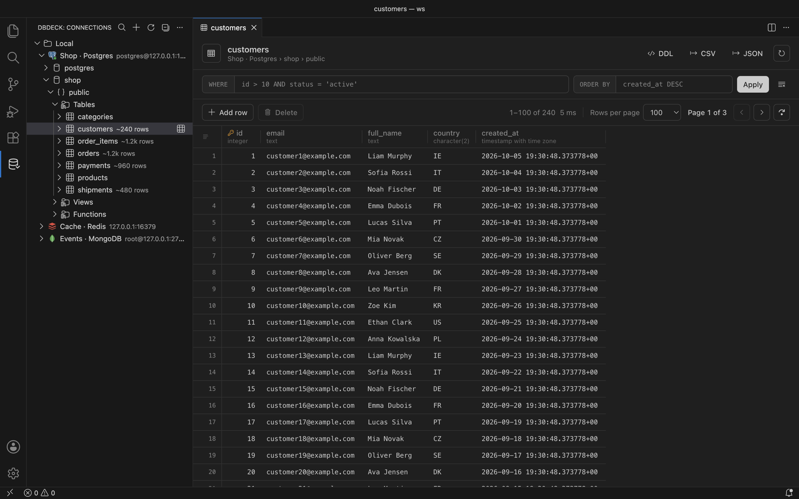

<h1 align="center">DBDeck</h1>

<p align="center">
  <b>Your databases. Inside your editor.</b><br>
  A free, open-source database client for VS Code and Cursor.<br>
  No accounts, paywalls, telemetry or cloud sync.
</p>

<p align="center">
  <a href="./LICENSE"></a>
  <a href="https://github.com/jurasw/dbdeck/actions/workflows/extension-check-on-pr.yml"></a>
  <a href="https://github.com/jurasw/dbdeck/stargazers"></a>
</p>

<p align="center">
  <a href="https://dbdeck.dev">dbdeck.dev</a> ·
  <a href="https://github.com/jurasw/dbdeck/releases">Releases</a> ·
  <a href="./CONTRIBUTING.md">Contribute</a> ·
  <a href="https://github.com/jurasw/dbdeck/issues/new/choose">Report a bug</a>
</p>



PostgreSQL, MySQL / MariaDB, ClickHouse, MongoDB, Redis, Elasticsearch / OpenSearch, S3 and Docker in one sidebar: SQL editor, data grid with inline edits, schema diagrams, key and document editors, SSH tunnels and read-only mode. Full feature list: [apps/extension/README.md](apps/extension/README.md).

## Install

Search **DBDeck** in the Extensions view of VS Code, Cursor, VSCodium or Windsurf, or download the VSIX from [GitHub Releases](https://github.com/jurasw/dbdeck/releases).

## Repository

```text
dbdeck/
├── apps/
│   ├── extension/       # VS Code / Cursor extension (published as dbdeck.dbdeck)
│   └── web/             # dbdeck.dev landing page (Next.js, shadcn/ui, Cloudflare)
├── assets/              # icon, screenshots, store listing texts, publishing guide
├── .agents/             # agent rules and task recipes
├── .github/workflows/   # extension checks and VSIX packaging
└── mprocs.yaml          # dev processes for phrocs / mprocs
```

## Development

Use Node.js 22 (`nvm use`) and install each app once:

```bash
(cd apps/extension && npm ci)
(cd apps/web && npm ci)
phrocs
```

`phrocs` (or `mprocs`) starts the landing page on http://localhost:3000 and the extension watcher. From its sidebar you can also start an Extension Development Host, the test databases, validation, packaging, a local VSIX install and the website deploy. Pressing **F5** in VS Code at the repository root also launches the extension.

| Where            | Command            | Purpose                              |
| ---------------- | ------------------ | ------------------------------------ |
| `apps/extension` | `npm run validate` | Type check, lint, test and build     |
| `apps/extension` | `npm run package`  | Build `dbdeck-<version>.vsix`        |
| `apps/web`       | `npm run dev`      | Landing page with hot reload         |
| `apps/web`       | `npm run build`    | Static export to `apps/web/out`      |
| `apps/web`       | `npm run deploy`   | Build and deploy to Cloudflare       |

See [CONTRIBUTING.md](CONTRIBUTING.md) for checks and conventions and [assets/marketplace/publishing.md](assets/marketplace/publishing.md) for releases.

## License

[MIT](LICENSE).
