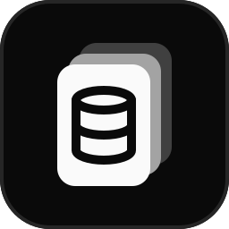
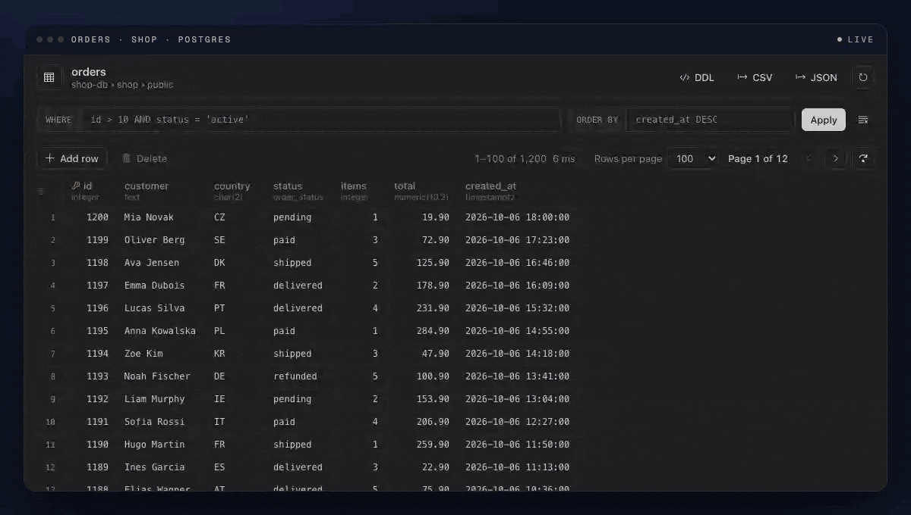
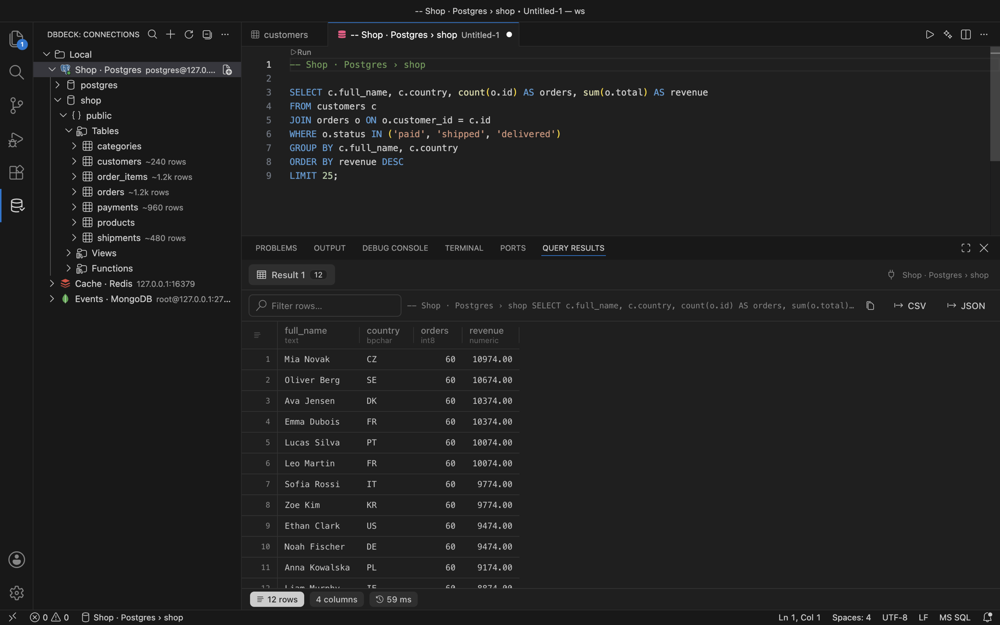
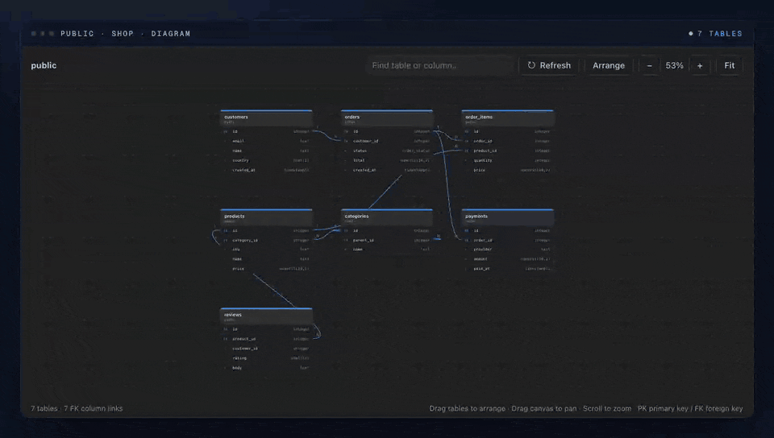
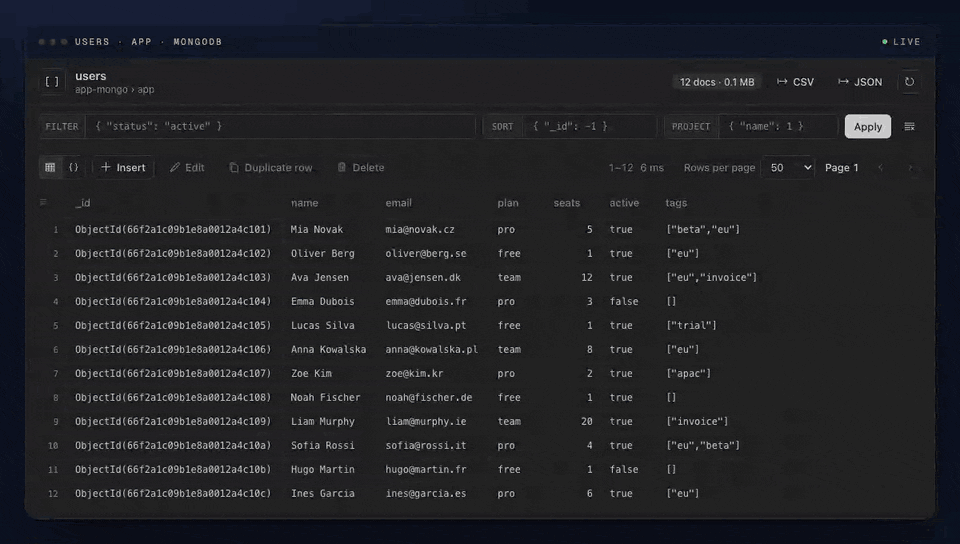
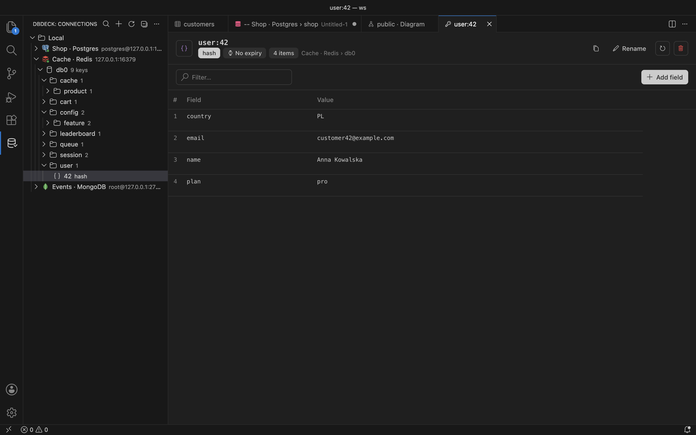
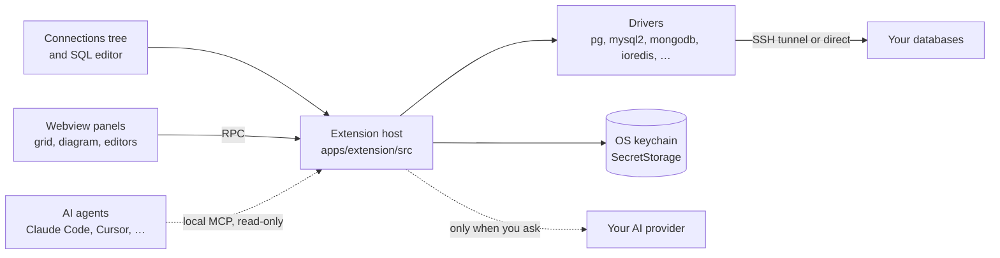

<p align="center">
  <a href="https://dbdeck.dev">
    
  </a>
</p>

<h1 align="center">DBDeck</h1>

<p align="center">
  <b>Your databases. Inside your editor.</b>
  <br>
  A free, open source database client for VS Code and Cursor.
  <br>
  No account, no paywall, no telemetry.
</p>

<p align="center">
  <a href="https://marketplace.visualstudio.com/items?itemName=dbdeck.dbdeck"></a>
  <a href="https://open-vsx.org/extension/dbdeck/dbdeck"></a>
  <a href="./LICENSE"></a>
  <a href="https://github.com/jurasw/dbdeck/actions/workflows/extension-check-on-pr.yml"></a>
  <a href="https://github.com/jurasw/dbdeck/stargazers"></a>
  <a href="./CONTRIBUTING.md"></a>
</p>

<p align="center">
  <a href="https://marketplace.visualstudio.com/items?itemName=dbdeck.dbdeck"><b>Install</b></a> ·
  <a href="https://dbdeck.dev">dbdeck.dev</a> ·
  <a href="https://open-vsx.org/extension/dbdeck/dbdeck">Open VSX</a> ·
  <a href="https://github.com/jurasw/dbdeck/releases/latest">Download VSIX</a> ·
  <a href="apps/extension/CHANGELOG.md">Changelog</a> ·
  <a href="https://github.com/jurasw/dbdeck/issues/new/choose">Report a bug</a> ·
  <a href="https://buymeacoffee.com/dbdeck">Support DBDeck</a>
</p>

<p align="center">
  <a href="https://dbdeck.dev">
    
  </a>
  <br>
  <sub>The extension's own data grid, fed with a demo shop database. Screenshots below come from VS Code.</sub>
</p>

## What it does

DBDeck puts your databases next to your code.
Add a connection, open a table and you are browsing rows, running SQL and fixing data without switching to another app.
Every connection lives in one sidebar tree, with SSH tunnels, SSL and read-only mode on each of them.
Omnisearch finds values across a database or schema, with table, value and column previews.
Nothing leaves your machine except the queries you send to your own databases.

<p align="center">
  <picture>
    <source media="(prefers-color-scheme: dark)" srcset="assets/readme/services-dark.svg">
    
  </picture>
</p>

<table>
  <tr>
    <td valign="top" width="50%">
      
      <h3>SQL editor</h3>
      <p>Put the cursor in a statement and press <kbd>⌘</kbd> <kbd>Enter</kbd>.
      Each statement gets its own result tab, with table and column completion that understands aliases.</p>
    </td>
    <td valign="top" width="50%">
      
      <h3>Schema diagrams</h3>
      <p>Any PostgreSQL, MySQL, SQLite, Cloudflare D1, Oracle or MSSQL schema as a diagram, foreign keys linked column to column.
      Drag, pan, zoom and search; hover a table to light up its relations.</p>
    </td>
  </tr>
</table>

<table>
  <tr>
    <td valign="top" width="50%">
      
      <h3>Documents, edited in place</h3>
      <p>MongoDB and Elasticsearch documents in a grid or a JSON tree.
      Double-click a field to change it, edit nested values and keys in the JSON view, or write shell-style queries like <code>db.users.find({...}).sort(...)</code>.</p>
    </td>
    <td valign="top" width="50%">
      
      <h3>Redis keys</h3>
      <p>Keys grouped by separator, with editors for strings, hashes, lists, sets, sorted sets, streams and RedisJSON.
      TTL, rename and a built-in CLI.</p>
    </td>
  </tr>
</table>

- **MSSQL** connects to SQL Server and Azure SQL with SQL authentication. Browse databases and schemas, edit primary-key rows in a transaction, run SQL, search values and view foreign key diagrams.
- **DynamoDB** browses tables and items with native paging and runs PartiQL queries. Use access keys, optional session tokens or the AWS credential chain; custom endpoints support DynamoDB Local.
- **Cassandra** browses keyspaces and tables with native paging, column metadata and CQL queries. Configure a contact point and local datacenter, with optional authentication and TLS.
- **DynamoDB and Cassandra changes** run in the query editor. Staged grid editing and full-text table search are unavailable; Cassandra uses key-based CQL filters. DynamoDB table definitions show AWS metadata, and exact row counts are unavailable.
- **Connection picker** shows sixteen compact buttons in two rows, ordered by database usage in the [Stack Overflow Developer Survey 2026](https://survey.stackoverflow.co/2026/technology/data/databases). D1 follows the ranked databases; storage and container tools follow D1.

- **Cloudflare D1** connects with an Account ID, Database ID and API token. Browse tables, run SQL, search values and view foreign keys. The grid is read-only; run DML from the SQL editor.
- **Oracle** connects by host, port and service name using Thin mode, without Oracle Client libraries. Browse schemas, run SQL and PL/SQL, edit rows in a transaction and view foreign keys.
- **SQLite files** as connections: pick a `.db`, `.sqlite` or `.sqlite3` file to browse, query and edit it. Nothing to install.
- **Paste a connection URL** from Neon, Supabase, PlanetScale or Heroku and DBDeck fills the form. The URL itself is not stored.
- **Inline row edits** for PostgreSQL, MySQL, SQLite, Oracle and MSSQL tables with a primary key. Changes are staged and saved in one transaction, and the confirmation toast offers **Undo**.
- **Responsive table browsing**: fast first-page results appear with the panel, wide tables render only visible rows and columns, and tables open in a reusable preview tab. A start tab with recent tables loads in the background so the first table appears at once.
- **Docker containers become connections** in one click: DBDeck reads the credentials from the container environment.
- **AI queries** with ChatGPT sign-in, your own OpenAI or Claude API key or a local Ollama model. Only table and column names are shared, never rows.
- **Chat with Database**: ask questions about a SQL, MongoDB or Elasticsearch connection in a chat panel. The assistant reads the schema itself; turn on read-only queries to let it answer from your data. Queries in answers open in an editor or run read-only in the chat.
- **MCP server for AI agents**: Claude Code, Cursor, Copilot and Codex read schema and run read-only queries on connections you allow. Changes open in an editor for your review.
- **BigQuery and Snowflake** in the same tree. BigQuery signs in with Google under Options or with a service account key and previews tables for free. Snowflake signs in with a programmatic access token or a key pair. Both are read-only in the grid; run DML from the SQL editor.
- **Elasticsearch through Kibana**: choose **Kibana URL**, enter the address, open **Kibana API keys** and sign in with Google or company SSO in your browser. Create a Personal API key, paste its Encoded value and test the connection. DBDeck connects through Kibana or directly on Elastic Cloud; browser sign-in alone does not connect the extension.
- **S3, MinIO, R2 and Google Cloud Storage** buckets in the same tree: open, upload, download, copy the `s3://` or `gs://` URI. Google Cloud Storage signs in with your Google account under Options.
- **Read-only connections** block every write, and destructive actions always ask first.

Describe a filter in the WHERE field of a SQL table, the FILTER field of a MongoDB collection or the QUERY field of an Elasticsearch index and click the sparkle button to generate a condition from its schema. MongoDB fields come from a local sample of up to 100 documents; only field names and types are sent. DBDeck applies it right away; edit the condition and press Enter to refine it. If AI is not connected, DBDeck opens **AI settings**; connect a provider, choose a model and use **Back to table** to return with your text preserved.

AI Query builds its context automatically: from a schema it uses that schema, from a table or database it uses the whole database with the current table first. The compact composer includes the Generate query action inside the input area; expand Database context to inspect or search the included tables.

Full feature list: [apps/extension/README.md](apps/extension/README.md).

## Your credentials stay on your machine

DBDeck talks to the databases you add and to nothing else.
There is no backend to sign in to, so there is no backend to leak.

| Data                  | Lives in                    | Note           |
| --------------------- | --------------------------- | -------------- |
| Connection settings   | Editor global state         | this machine   |
| Passwords and keys    | OS keychain (SecretStorage) | encrypted      |
| Remember password off | Session memory              | gone on reload |
| Query results         | Not stored                  |                |
| Telemetry             | None                        |                |

## Install

| Editor                     | Where                                                                                                      |
| -------------------------- | ---------------------------------------------------------------------------------------------------------- |
| VS Code                    | [Visual Studio Marketplace](https://marketplace.visualstudio.com/items?itemName=dbdeck.dbdeck)             |
| Cursor, VSCodium, Windsurf | [Open VSX Registry](https://open-vsx.org/extension/dbdeck/dbdeck)                                          |
| Anything else              | [VSIX from GitHub Releases](https://github.com/jurasw/dbdeck/releases/latest), then **Install from VSIX…** |

```bash
code --install-extension dbdeck.dbdeck
cursor --install-extension dbdeck.dbdeck
codium --install-extension dbdeck.dbdeck
windsurf --install-extension dbdeck.dbdeck
```

Open **DBDeck** in the activity bar, choose **Add Connection** and pick a database type.

## How it fits together



| Path             | What it is                                                                         |
| ---------------- | ---------------------------------------------------------------------------------- |
| `apps/extension` | The VS Code / Cursor extension, published as `dbdeck.dbdeck`                       |
| `apps/web`       | The [dbdeck.dev](https://dbdeck.dev) landing page (Next.js, shadcn/ui, Cloudflare) |
| `assets`         | Icon, screenshots, README media, store listing texts and publishing guide          |
| `.agents`        | Agent rules and task recipes                                                       |
| `.github`        | Extension checks and VSIX packaging workflows                                      |
| `mprocs.yaml`    | Dev processes for phrocs / mprocs                                                  |

## Developing locally

Use Node.js 22 (`nvm use`) and install each app once:

```bash
(cd apps/extension && npm ci)
(cd apps/web && npm ci)
phrocs
```

`phrocs` (or `mprocs`) starts the landing page on http://localhost:3000 and the extension watcher.
From its sidebar you can also start an Extension Development Host, the test databases, validation, packaging, a local VSIX install and the website deploy.
Pressing **F5** in VS Code at the repository root also launches the extension.

| Where            | Command            | Purpose                          |
| ---------------- | ------------------ | -------------------------------- |
| `apps/extension` | `npm run validate` | Type check, lint, test and build |
| `apps/extension` | `npm run package`  | Build `dbdeck-<version>.vsix`    |
| `apps/web`       | `npm run dev`      | Landing page with hot reload     |
| `apps/web`       | `npm run build`    | Static export to `apps/web/out`  |
| `apps/web`       | `npm run deploy`   | Build and deploy to Cloudflare   |

The landing page exports a canonical URL, application structured data, `robots.txt` and `sitemap.xml`. After deploying website SEO changes, verify the `dbdeck.dev` domain in Google Search Console through a DNS TXT record, submit `https://dbdeck.dev/sitemap.xml`, and inspect `https://dbdeck.dev/` to request indexing. Add new public pages to `apps/web/public/sitemap.xml` when creating them.

## Contributing

Bug reports, feature ideas and pull requests are welcome.
Read [CONTRIBUTING.md](CONTRIBUTING.md) for checks and conventions and [assets/marketplace/publishing.md](assets/marketplace/publishing.md) for releases.

<a href="https://github.com/jurasw/dbdeck/graphs/contributors">
  
</a>

## Support DBDeck

DBDeck is free and open source. If it helps you, you can [buy us a coffee](https://buymeacoffee.com/dbdeck) to support its development. Support is optional and does not unlock any features.

## License

[MIT](LICENSE). Free forever, with no paid tier and no feature behind a key.

### Search all values

**Omnisearch** searches a whole database or schema in PostgreSQL, MySQL / MariaDB, SQLite, Cloudflare D1, Oracle, MSSQL, ClickHouse, BigQuery, Snowflake and MongoDB. Click the document-with-magnifier icon next to a database or schema in Connections, or run **DBDeck: Omnisearch** from the Command Palette. Type `JUREK` to see results such as `players: Jurek (name)`. Matching ignores letter case and treats the phrase as a literal substring. MongoDB includes nested fields and arrays. Choose a result to open a separate data tab with that search applied, preserving existing tabs and edits.

Results arrive as tables are searched. Previews cover up to 20 matching rows per table and 200 distinct table/column/value results overall; limits and skipped objects are shown. The scan searches beyond the first page and can be expensive on large databases. Changing the phrase or pressing Escape stops further requests after the current request finishes. Data stays between your editor and your database.

Use **Search all records** in a data viewer to search beyond the current page in the current table, collection or index. Press Enter or the search arrow to run the search immediately; a spinner in the search field shows while results load. Existing filters still apply. SQL searches every column; MongoDB also searches nested values and arrays, streaming documents to your editor. Elasticsearch searches indexed fields using its query semantics. Results remain paginated.
