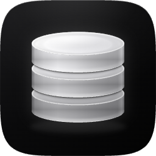

  

<h1 align="center">DBDeck</h1>

A standalone [macOS desktop demo](https://dbdeck.dev/#desktop-demo) is also available from source, with local DMG packaging for Apple Silicon and Intel. It shares this extension's drivers, connection form, data grid, query execution, schema diagrams and Redis key editor. AI, MCP and editor integrations remain extension features.

  <b>Your databases. Inside your editor.</b> 
  A free, open-source database client for VS Code and Cursor. 
  No accounts, paywalls, telemetry or cloud sync.

  <a href="https://dbdeck.dev">Website</a> ·
  <a href="https://github.com/jurasw/dbdeck">GitHub</a> ·
  <a href="https://github.com/jurasw/dbdeck/issues/new/choose">Report a bug</a>

  

## What it does

Browse databases, run queries and edit data without leaving your editor. Keep connections together, use SSH tunnels and inspect results in a virtualized grid.

| Service                     | Tools                                                          |
| --------------------------- | -------------------------------------------------------------- |
| PostgreSQL, MySQL / MariaDB | SQL editor, data grid, primary-key row editing, DDL            |
| SQLite                      | Local database files, SQL editor, row editing, DDL             |
| Cloudflare D1               | SQL editor, tables and views, DDL, diagrams                    |
| MSSQL                       | SQL editor, schemas, primary-key row editing, DDL, diagrams    |
| DynamoDB                    | Tables, item browsing, native paging and PartiQL queries       |
| Cassandra                   | Keyspaces, tables, native paging, column metadata, CQL and DDL |
| Oracle                      | SQL and PL/SQL, schemas, row editing, DDL, diagrams            |
| ClickHouse                  | SQL editor, data browsing, DDL                                 |
| BigQuery                    | SQL editor, datasets, free table preview, DDL                  |
| Snowflake                   | SQL editor, data browsing, DDL                                 |
| MongoDB                     | Document editor, filters, aggregation and shell-style scripts  |
| Redis                       | Key browser, value editors, TTL, CLI                           |
| Elasticsearch / OpenSearch  | Index browser, documents and request console                   |
| S3 / MinIO / R2 / GCS       | Buckets, folders, uploads and downloads                        |
| Docker                      | Containers, logs, shell and database connection discovery      |

## Features

- **MSSQL** connects to SQL Server and Azure SQL with SQL authentication. Browse databases and schemas, edit primary-key rows in a transaction, run SQL, search values and view foreign key diagrams.
- **DynamoDB** browses tables and items with native paging and runs PartiQL queries. Use access keys, optional session tokens or the AWS credential chain; custom endpoints support DynamoDB Local.
- **Cassandra** browses keyspaces and tables with native paging, column metadata and CQL queries. Configure a contact point and local datacenter, with optional authentication and TLS.
- **DynamoDB and Cassandra changes** run in the query editor. Staged grid editing and full-text table search are unavailable; Cassandra uses key-based CQL filters. DynamoDB table definitions show AWS metadata, and exact row counts are unavailable.
- **Connection picker** shows sixteen compact buttons in two rows, ordered by database usage in the [Stack Overflow Developer Survey 2026](https://survey.stackoverflow.co/2026/technology/data/databases). D1 follows the ranked databases; storage and container tools follow D1.

- Paste a connection URL (`postgresql://`, `mysql://`, `clickhouse://`, `redis://`, `sqlite:`) to fill the connection form, for example from Neon, Supabase, PlanetScale or Heroku. The URL itself is not stored
- Connection tree with groups (rename or delete from the context menu), per-type icons and connection status
- Omnisearch: find values across a database or schema, with table, value and column previews
- SSH tunnels (password or private key), SSL/TLS, read-only mode
- Data viewer with a virtualized grid: server-side paging, sorting, `WHERE` / `ORDER BY` filters, column resize, keyboard navigation, copy as TSV / JSON / `INSERT`
- Fast first-page results appear with the panel; wide tables render only visible rows and columns to keep scrolling responsive. Tables open in a reusable preview tab, and a start tab with recent tables loads in the background so the first table appears at once
- Inline editing for PostgreSQL, MySQL, SQLite, Oracle and MSSQL tables with a primary key: edit cells, add, duplicate and delete rows, set `NULL`. Changes are staged and saved in one transaction, with **Undo** in the confirmation toast
- SQL editor: run the statement under the cursor (`⌘/Ctrl+Enter`), run all (`⌘/Ctrl+Shift+Enter`), `▶ Run` CodeLens, table and column completion with alias resolution
- Results panel: one tab per statement, row filter, JSON view, export to CSV / JSON
- DDL for tables, views, functions and procedures; truncate and drop
- MongoDB: document grid and JSON view, filter / sort / projection, edit / insert / clone / delete documents, shell-style scripts (`db.users.find({...}).sort(...)`, `aggregate`, `ObjectId()`, `ISODate()`)
- Redis: key tree grouped by separator, SCAN filter, editors for string (text / JSON), hash, list, set, sorted set, stream and RedisJSON, TTL and rename, built-in CLI terminal
- Elasticsearch: index list with health, field mapping, document search (query string or DSL), edit / add / delete documents, Kibana-style request console (`.esreq` files). Choose **Kibana URL**, enter the address and use **Open Kibana API keys** to sign in with Google or company SSO in your browser. Create a Personal API key, paste its Encoded value and test the connection. Browser sign-in alone does not connect the extension
- S3: buckets and folders in the tree, open / download / upload / delete objects, copy `s3://` URI; works with AWS, MinIO, Cloudflare R2 and other S3-compatible servers, and with Google Cloud Storage through Sign in with Google under Options
- Docker: containers grouped by Compose project, start / stop / restart / remove, logs, shell, inspect, images, volumes, networks, and **Add as Database Connection** that reads credentials from container env
- Cloudflare D1: connect with an Account ID, Database ID and Cloudflare API token with D1 Read (browsing) or D1 Write (SQL changes). Tables, views, DDL, Omnisearch and foreign key diagrams. The grid is read-only; run DML from the SQL editor. Tokens use the OS keychain or session memory according to Remember token
- Oracle: connect by host, port and service name (for example FREEPDB1). Thin mode supports Oracle Database 12.1 or later without Oracle Client libraries. Schemas, tables, views, SQL and PL/SQL, row editing in a transaction, DDL, Omnisearch and foreign key diagrams. SSH tunnels and TLS are available
- SQLite: open a `.db`, `.sqlite` or `.sqlite3` file. Tables, views and columns in the tree, row editing with foreign keys enforced, indexes and triggers in DDL. Read-only mode opens the file read-only. Needs a current VS Code or Cursor (Node 22.16 or later in the extension host)
- BigQuery: datasets and tables in the tree, free table preview through the BigQuery API, row counts from table metadata and the bytes each query processes. Signs in with Sign in with Google under Options (`gcloud auth application-default login`) or a service account key file
- Snowflake: databases, schemas, tables and views in the tree, SQL with your warehouse and role. Signs in with a programmatic access token or a key pair
- Panels follow your editor color theme: buttons, inputs, menus, selection and value colors come from the active VS Code or Cursor theme

## Getting started

Install **DBDeck** from the Extensions view in VS Code (Visual Studio Marketplace) or in Cursor, VSCodium and Windsurf (Open VSX). You can also download the VSIX from [GitHub Releases](https://github.com/jurasw/dbdeck/releases) and choose **Extensions: Install from VSIX…**.

Open **DBDeck** in the activity bar, choose **Add Connection**, then select a database type. Open a table or create a query from the connection menu.

| Action                | macOS           | Windows / Linux  |
| --------------------- | --------------- | ---------------- |
| Run current statement | Cmd+Enter       | Ctrl+Enter       |
| Run all statements    | Cmd+Shift+Enter | Ctrl+Shift+Enter |

## Screenshots

<table>
  <tr>
    <td valign="top" width="50%">
      
      <h3>SQL editor</h3>
      
Put the cursor in a statement and press <kbd>⌘</kbd> <kbd>Enter</kbd>.
      Each statement gets its own result tab, with table and column completion that understands aliases.

    </td>
    <td valign="top" width="50%">
      
      <h3>Schema diagrams</h3>
      
Any PostgreSQL, MySQL, SQLite, Cloudflare D1, Oracle or MSSQL schema as a diagram, foreign keys linked column to column.
      Drag, pan, zoom and search; hover a table to light up its relations.

    </td>
  </tr>
  <tr>
    <td valign="top" width="50%">
      
      <h3>Documents, edited in place</h3>
      
MongoDB and Elasticsearch documents in a grid or a JSON tree.
      Double-click a field to change it, or write shell-style queries like <code>db.users.find({...}).sort(...)</code>.

    </td>
    <td valign="top" width="50%">
      
      <h3>Redis keys</h3>
      
Keys grouped by separator, with editors for strings, hashes, lists, sets, sorted sets, streams and RedisJSON.
      TTL, rename and a built-in CLI.

    </td>
  </tr>
</table>

## Privacy

DBDeck makes network connections only to the databases you configure. Nothing is sent anywhere else.

- Connection settings are stored in VS Code / Cursor global state on this machine.
- Passwords, API keys and connection strings are stored in the OS keychain through VS Code SecretStorage.
- Turn off **Remember password** on a connection to keep its secrets in memory only: you are asked for them once per session and nothing is written to disk.
- Query results are not stored.

## Schema diagram

Choose **Show Schema Diagram** on a SQL database or PostgreSQL schema in Connections. Tables show columns, primary keys and foreign keys, with column-to-column relationship lines for PostgreSQL, MySQL/MariaDB, SQLite, Cloudflare D1, Oracle and MSSQL. Drag table headers to arrange cards, drag the dotted canvas to pan, and scroll to zoom. Hover a table to highlight its relations and related tables; search highlights the links of matching tables. Use **Fit**, **Arrange**, search and **Refresh** from the toolbar. The panel remembers its layout when restored. ClickHouse, BigQuery and Snowflake display tables and columns without foreign key relationships. Relationships to tables outside the selected schema/database are omitted.

## Search all values

**Omnisearch** searches a whole database or schema in PostgreSQL, MySQL / MariaDB, SQLite, Cloudflare D1, Oracle, MSSQL, ClickHouse, BigQuery, Snowflake and MongoDB. Click the document-with-magnifier icon next to a database or schema in Connections, or run **DBDeck: Omnisearch** from the Command Palette. Type `JUREK` to see results such as `players: Jurek (name)`. Matching ignores letter case and treats the phrase as a literal substring. MongoDB includes nested fields and arrays. Choose a result to open a separate data tab with that search applied, preserving existing tabs and edits.

Results arrive as tables are searched. Previews cover up to 20 matching rows per table and 200 distinct table/column/value results overall; limits and skipped objects are shown. The scan searches beyond the first page and can be expensive on large databases. Changing the phrase or pressing Escape stops further requests after the current request finishes. Data stays between your editor and your database.

Use **Search all records** in a data viewer to search beyond the current page in the current table, collection or index. Press Enter or the search arrow to run the search immediately; a spinner in the search field shows while results load. Existing filters still apply. SQL searches every column; MongoDB also searches nested values and arrays, streaming documents to your editor. Elasticsearch searches indexed fields using its query semantics. Results remain paginated.

## AI queries

Describe a filter in the SQL table’s WHERE field and click the sparkle button to generate a condition from that table’s schema. DBDeck applies it right away; edit the condition and press Enter to refine it. If AI is not connected, DBDeck opens **AI settings**; connect a provider, choose a model and use **Back to table** to return with your text preserved.

AI Query scrolls with the panel height and groups provider, model and account controls under **AI settings**, opened with the circular gear beside **AI agents (MCP)**.

Use **DBDeck: Generate Query with AI**, the **Generate query with AI** action at the bottom of a bound SQL editor, or the SQL connection/table context menu. The schema or database where you open AI supplies the context automatically; from a table, the whole database is included with that table first. Describe your request in any language and review the generated SQL. **Open in query editor** creates a query bound to the selected connection; it does not execute it. PostgreSQL, MySQL, SQLite, Cloudflare D1, Oracle, MSSQL, DynamoDB, Cassandra, ClickHouse, BigQuery and Snowflake are supported.

Choose **OpenAI · Continue with ChatGPT** to authorize DBDeck directly through OpenAI using your own eligible ChatGPT plan or credits. DBDeck uses OpenAI's public Responses API and your account's model catalog. Manage access and limits in [ChatGPT Settings → Usage](https://chatgpt.com/settings/usage). Availability depends on OpenAI's preview and your account permissions. See [OpenAI's sign-in documentation](https://developers.openai.com/siwc/token-sharing-open-source/sign-in).

Choose **Anthropic · Claude API key** to use Claude with a key from [Claude Console](https://platform.claude.com/). Anthropic does not allow third-party apps to sign in with a Claude.ai account, so Claude Pro and Max subscribers connect Claude Code to DBDeck through MCP instead (see below).

Alternatively, supply your own OpenAI API key, an OpenAI-compatible provider URL and key, or an installed Ollama model (`http://127.0.0.1:11434/v1`). API charges are paid directly by the user. Remote providers must use HTTPS. Use **DBDeck: Disconnect AI Provider** to remove the active provider's credentials; ChatGPT sign-out also attempts to revoke its renewable session.

DBDeck has no AI backend, credential service or prompt analytics. Requests go from the extension host directly to the chosen provider. Only the written request and selected table/column names, types and key metadata are sent; database rows, passwords and connection strings are excluded. Provider data policies still apply. API keys and ChatGPT credentials are kept in VS Code SecretStorage, outside webview state and project files. Provider/model preferences and a stable local OAuth host identifier are stored in the editor. ChatGPT account registrations are kept separately; sign-out removes tokens while retaining the registration for later sign-in. No OpenAI client secret or publisher-owned API key is required.

AI Query builds its context automatically: from a schema it uses that schema, from a table or database it uses the whole database with the current table first. The compact composer includes the Generate query action inside the input area; expand Database context to inspect or search the included tables.

## Chat with Database

Click the sparkle button in a SQL table's header to open the assistant beside the table with that table as context. Hover a SQL connection in Connections and click its chat icon, click the chat icon in a bound SQL editor, choose **Chat with database** in AI Query, run **DBDeck: Chat with Database**, or right-click a SQL connection, database or schema in Connections. Ask questions in any language. The assistant calls `list_tables` and `describe_table` to read the schema and answers with SQL in code blocks. Each code block has **Copy**, **Open in editor** and **Run**; **Run** executes the statement read-only and shows the rows in the chat without sending them to the AI.

Turn on **Let AI run read-only queries** to let the assistant run SELECT, WITH, SHOW, DESCRIBE and EXPLAIN statements itself and answer from the results. DBDeck asks once per connection. Queries run through the same read-only path as MCP; the assistant gets at most 100 rows per query and the chat shows up to 200. Query results go to your AI provider; without this option only table and column names do. Inserts, updates and schema changes never run from the chat.

The chat uses the provider and model from **AI settings**: ChatGPT, an OpenAI or Claude API key, an OpenAI-compatible API or Ollama. Local models must support tool calling. **New chat** clears the conversation; nothing is saved.

## Settings

Choose **Settings** in the `…` menu of the Connections view, or run **DBDeck: Settings**. One page holds the AI provider, model and ChatGPT account, the connections where the chat may run queries, the MCP server and its allowed connections, rows per page and per result, CodeLens, Redis key options, and connection import and export. **Open in editor settings** shows the same options in the VS Code settings editor.

## AI agents (MCP)

Run **DBDeck: Connect AI Agents (MCP)** to start a local MCP server. Agents can then list your SQL connections, inspect tables and columns, run read-only queries and open SQL in a query editor for you to review. Agents work with your own AI subscription, for example Claude Code with a Claude Pro or Max plan.

- VS Code and Cursor see DBDeck automatically while the server runs.
- For Claude Code, choose **Copy Claude Code command** and run it in a terminal. **Copy MCP JSON config** works for Claude Desktop, Windsurf and other clients.
- Before an agent reads a connection for the first time, DBDeck asks you. **Forget allowed connections** resets these answers.
- `run_query` runs one SELECT, WITH, SHOW, DESCRIBE or EXPLAIN statement in a read-only transaction (ClickHouse: `readonly=1`; BigQuery: at most 10 GB billed per query; SQLite: a read-only connection to the file; Cloudflare D1: write plans rejected before execution; Oracle: SELECT statements in a read-only transaction; MSSQL: single SELECT/CTE with write keywords rejected; DynamoDB and Cassandra: single SELECT only) with service-specific request limits. Up to `dbdeck.mcp.maxRows` rows (default 200) go back to the agent.
- `open_query` never runs SQL. Inserts, updates and schema changes open in a query editor so you run them yourself.
- The server listens on `127.0.0.1` only and needs an access token kept in SecretStorage. **Regenerate access token** replaces it. Turn the server off from the same command or with `dbdeck.mcp.enabled`.

Query results that an agent reads are sent to that agent's AI provider. For full protection on production, give the connection a database user with read-only privileges.

## License

[MIT](https://github.com/jurasw/dbdeck/blob/main/LICENSE).
